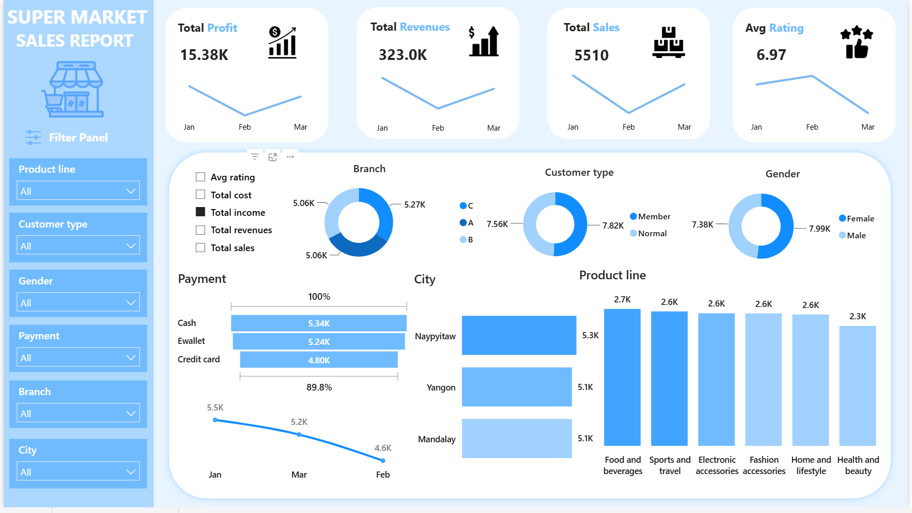
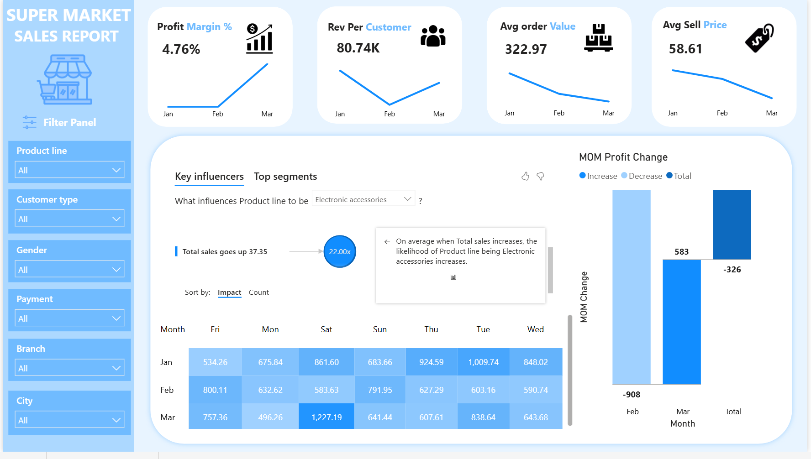
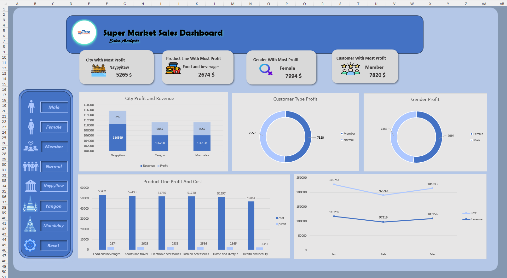
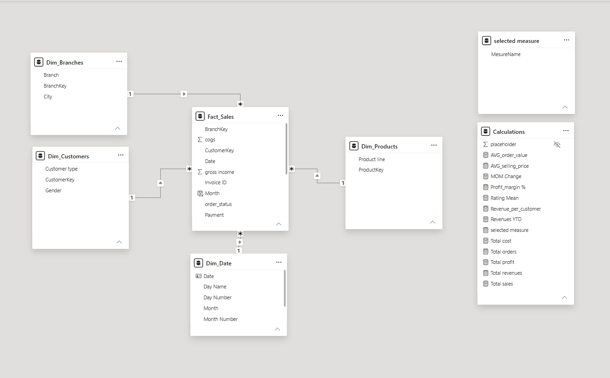

# Supermarket Sales Analytics


A complete retail analytics solution designed to evaluate supermarket sales performance, customer behavior, product profitability, and branch operations through SQL Server, Power BI, Excel, and dimensional modeling.

---

## Project Overview

This project transforms transactional supermarket data into business intelligence insights that support revenue growth and operational optimization.

- $322,966.75 Total Revenue  
- $15,379.37 Total Profit  
- 4.76% Net Profit Margin  
- 5,510 Transactions Analyzed  
- 6.97 / 10 Average Customer Rating  

## Navigation Pane

- New to this project? → [Getting Started](#getting-started)  
- Want dashboards? → [Dashboards](#dashboards)  
- Interested in SQL analysis? → [SQL Queries](#sql-queries)  
- Looking for insights? → [Key Insights](#key-insights)  
- Need resources? → [Reference Resources](#reference-resources)  
- Contact me? → [Support & Contact](#support--contact)  

---

## Key Insights

### Branch Performance
| Branch | Profit |
|--------|--------|
| Naypyitaw (C) | $5,265 |
| Yangon (A)    | $5,057 |
| Mandalay (B)  | $5,057 |

Profitability is balanced across branches, with Naypyitaw slightly leading.

---

### Product Performance
| Product Line | Profit |
|--------------|--------|
| Food & Beverages | $2,674 |
| Sports & Travel  | $2,625 |
| Electronic Accessories | $2,588 |
| Fashion Accessories    | $2,586 |
| Home & Lifestyle       | $2,565 |
| Health & Beauty        | $2,343 |

Food & Beverages leads, but diversification reduces risk.

---

### Customer Segments
- Members: $7,820 profit  
- Normal Customers: $7,559 profit  
- Female Customers: $7,994 profit  
- Male Customers: $7,385 profit  

Female Members are the highest‑value segment.

---

### Order Size Analysis
| Order Size | Profit Contribution |
|------------|---------------------|
| Large      | 62% |
| Medium     | 27% |
| Small      | 11% |

Large orders dominate profitability.

## Dashboards

### 1. Executive Dashboard
  
High‑level overview of revenue, profit, margin, ratings, and branch performance.

---

### 2. Detailed Analytics Dashboard
  
Deep dive into product mix, customer segments, and sales trends.

---

### 3. Excel Dashboard
  
Interactive Excel dashboard with pivot tables, charts, and slicers.

---

### 4. Data Model
  
Star Schema Design:  
- Fact_Sales (Revenue, Quantity, Gross Income, Tax, COGS)  
- Dim_Customers (Customer Type, Gender)  
- Dim_Products (Product Line)  
- Dim_Branches (Branch, City)  
- Dim_Date (Day, Month, Year)  

## SQL Queries

### Branch Profitability
```sql
SELECT
    db.Branch,
    db.City,
    COUNT(fs.[Invoice ID]) AS Orders,
    SUM(fs.Total) AS Revenue,
    SUM(fs.[gross income]) AS Profit
FROM Fact_Sales fs
INNER JOIN Dim_Branches db
ON fs.BranchKey = db.BranchKey
GROUP BY db.Branch, db.City
ORDER BY Profit DESC;

---

### Customer Segmentation
```sql
SELECT
    dc.CustomerType,
    dc.Gender,
    SUM(fs.[gross income]) AS Profit
FROM Fact_Sales fs
INNER JOIN Dim_Customers dc
ON fs.CustomerKey = dc.CustomerKey
GROUP BY dc.CustomerType, dc.Gender;

---

### Product Performance
```sql
SELECT
    dp.ProductLine,
    SUM(fs.[gross income]) AS Profit
FROM Fact_Sales fs
INNER JOIN Dim_Products dp
ON fs.ProductKey = dp.ProductKey
GROUP BY dp.ProductLine
ORDER BY Profit DESC;

---

### Order Size Profitability

```markdown
### Order Size Profitability
```sql
SELECT
    fs.order_status,
    SUM(fs.[gross income]) AS Profit
FROM Fact_Sales fs
GROUP BY fs.order_status
ORDER BY Profit DESC;

---

### Male - Female Member Segmentation

```markdown
### Female Member Segmentation
```sql
SELECT
    dc.CustomerType,
    dc.Gender,
    COUNT(fs.[Invoice ID]) AS Orders,
    SUM(fs.Total) AS Revenue,
    SUM(fs.[gross income]) AS Profit,
    ROUND(AVG(fs.[gross income]), 2) AS Avg_Profit_Per_Order
FROM Fact_Sales fs
INNER JOIN Dim_Customers dc
ON fs.CustomerKey = dc.CustomerKey
WHERE dc.CustomerType = 'Member'
  AND dc.Gender = 'Female' OR dc.Gender = 'Male'
GROUP BY dc.CustomerType, dc.Gender;

## Business Recommendations

1. Anchor strategy in large orders → Incentivize bulk purchases with bundle pricing.  
2. Leverage loyalty programs → Expand member benefits to convert normal customers.  
3. Target female customers → Tailor promotions and product placement.  
4. Balance product line focus → Maintain diversification while letting Food & Beverages lead.  
5. Improve rating experience → Enhance service quality to lift margins.  
6. Replicate Naypyitaw’s model → Apply its operational practices across other branches.  

---

## Project Structure

```text
Supermarket-Sales-Analytics/
├── Dashboards/
│   ├── Main.png
│   ├── Details.png
│   ├── Excel.png
│   └── Model.png
├── SQL/
│   ├── Schema_Creation.sql
│   └── Analytical_Queries.sql
├── README.md
└── .gitignore

##  Support & Contact

**Project Author:** Mohamed Fouad  
**Email:** m.fouad.business002@gmail.com  
**LinkedIn:** <a href="https://linkedin.com/in/mohamed-fouad-88608424b" target="_blank">Mohamed Fouad</a>  
**GitHub:** <a href="https://github.com/mohamedfouad00" target="_blank">@mohamedfouad00</a>

##  License

This project is provided as-is for educational and business analytical purposes.

##  Contributing

Contributions are welcome! Please follow these steps:

1. Fork the repository
2. Create a feature branch (`git checkout -b feature/amazing-feature`)
3. Commit your changes (`git commit -m 'Add amazing feature'`)
4. Push to the branch (`git push origin feature/amazing-feature`)
5. Open a Pull Request

## Reference Resources

- <a href="https://app.powerbi.com/view?r=eyJrIjoiYjAwNTRkNTUtMmU0Ny00Y2JmLTgzYmYtNWQyYjRkYmNhZjIxIiwidCI6ImMzMGI1NDRmLWJhMTgtNGUyYy04YjllLTdmYWU5ZmU5NWUzYSJ9" target="_blank">Power BI Live Reports</a>  
- <a href="https://en.wikipedia.org/wiki/Star_schema" target="_blank">Star Schema Design</a>  
- <a href="https://drive.google.com/file/d/1zmV6ISU1w7JwGAL3n5hNAG8e5odfKMQG/view?usp=sharing" target="_blank">Marketing Campaign – Advanced Effectiveness, Sales & Customer Funnel Report</a>
